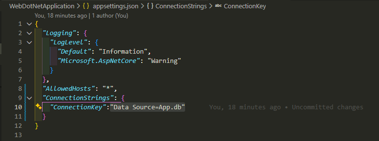
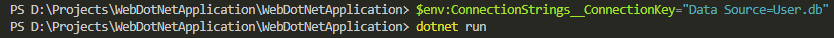
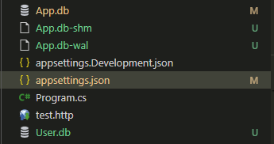

# ASP.NET Core Tutorial

## Overview

This is an ASP.NET Core web application with Entity Framework Core and SQLite database integration. This guide explains how to configure the database name through environment variables.

**Full tutorial:** <https://www.youtube.com/watch?v=YbRe4iIVYJk>

[](https://www.youtube.com/watch?v=YbRe4iIVYJk)

---

## Database Configuration via Environment Variables

### How It Works

The application reads the database connection string from the environment variable `ConnectionStrings__ConnectionKey`. This allows you to change the database name without modifying code.

### Connection String Format

```json
Data Source=<DatabaseName>.db
```

---

## Setting Database Name in Terminal

### Option 1: PowerShell (Persistent for Session)

Set the environment variable in your current PowerShell session:

```powershell
$env:ConnectionStrings__ConnectionKey="Data Source=YourDatabaseName.db"
```

Then run your application:

```powershell
dotnet run
```

**Example:**

```powershell
$env:ConnectionStrings__ConnectionKey="Data Source=User.db"
dotnet run
```


**Picture 1 Explanation:** This screenshot shows setting the connection string environment variable in PowerShell terminal. The syntax `$env:ConnectionStrings__ConnectionKey` uses double underscores (`__`) which is the convention in .NET for nested configuration keys. When you set this before running `dotnet run`, the application will use "User.db" as the database filename in the current directory.

---

### Option 2: Command Prompt (Windows CMD)

```cmd
set ConnectionStrings__ConnectionKey=Data Source=YourDatabaseName.db
dotnet run
```

**Example:**

```cmd
set ConnectionStrings__ConnectionKey=Data Source=User.db
dotnet run
```

---

### Option 3: Linux/macOS Terminal (Bash/Zsh)

```bash
export ConnectionStrings__ConnectionKey="Data Source=YourDatabaseName.db"
dotnet run
```

**Example:**

```bash
export ConnectionStrings__ConnectionKey="Data Source=User.db"
dotnet run
```

---

## Permanent Configuration (Optional)

### Windows - Add to System Environment Variables

1. Press `Win + X` → Select **System**
2. Click **Advanced system settings**
3. Click **Environment Variables**
4. Under **System variables**, click **New**
5. Variable name: `ConnectionStrings__ConnectionKey`
6. Variable value: `Data Source=YourDatabaseName.db`
7. Click **OK** and restart your terminal

### Linux/macOS - Add to ~/.bashrc or ~/.zshrc

```bash
echo 'export ConnectionStrings__ConnectionKey="Data Source=YourDatabaseName.db"' >> ~/.bashrc
source ~/.bashrc
```

---

## Explanation

### Configure in json



Demonstrates the database file creation with the specified name (e.g., `User.db`) appearing in the application directory after running with the custom connection string. This database file contains all the seeded roles (Admin, Manager, User, etc.) that are automatically created on first run by the Entity Framework Core seeding mechanism.

---

### Testing in other Database enviroment



Displays the application running with the configured database connection. Shows the successful startup and output when `dotnet run` executes after setting the environment variable. This confirms the application is using the connection string from the environment variable you just set.

---

### Result (Created new database)



Shows the PowerShell environment variable being set with the connection string configuration. This demonstrates how to set a temporary environment variable that persists for the current PowerShell session. The command `$env:ConnectionStrings__ConnectionKey="Data Source=User.db"` prepares the application to use "User.db" for the next `dotnet run` execution.

---

## Code Reference

### How the Connection String is Used

In **DataExtensions.cs**, the connection string is retrieved from configuration:

```csharp
public static void AddDataToDatabase(this WebApplicationBuilder builder)
{
    var conn = builder.Configuration.GetConnectionString("ConnectionKey");
    builder.Services.AddSqlite<WebAppContext>(
        conn,
        optionsAction: options => options.UseSeeding((context, _) =>
        {
            // Data seeding logic
        })
    );
}
```

The `GetConnectionString("ConnectionKey")` method reads from the environment variable `ConnectionStrings__ConnectionKey`.

---

## Common Database Names

```powershell
# Development database
$env:ConnectionStrings__ConnectionKey="Data Source=App.db"

# User management database
$env:ConnectionStrings__ConnectionKey="Data Source=User.db"

# Testing database
$env:ConnectionStrings__ConnectionKey="Data Source=Test.db"

# Production database
$env:ConnectionStrings__ConnectionKey="Data Source=Production.db"
```

---

## Troubleshooting

### Database not created?

- Ensure the environment variable is set **before** running `dotnet run`
- Check that the path is writable in your current directory
- Verify the syntax uses double underscores (`__`) not single underscores

### Connection refused?

- Make sure no other instance is using the database file
- Delete the `.db` file and let the application recreate it
- Check file permissions

### Default behavior

If no environment variable is set, the application will use the connection string from **appsettings.json** or **appsettings.Development.json**.

---

## Next Steps

1. Set your desired database name via environment variable
2. Run `dotnet run`
3. Application will automatically create and migrate the database
4. Access the application as configured in `launchSettings.json`
